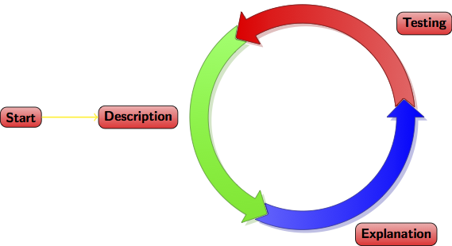
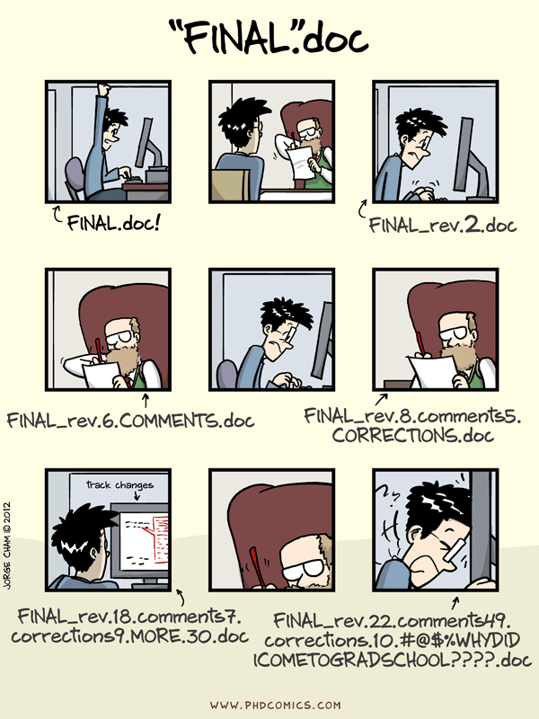

# Introduction

## Introduction

### **Why** this workshop?

- In the **social sciences** few attention to what tools to use (and why they make sense)

- Increasing **need** for/in openness & transparancy

    - from journals, universities and governments
    - increase in cooperation (over wider distances)
    - access to your own files
    - make yourself more visible 

### Goals of this workshop 

- To make you **familiar** with some concepts and tools, being aware of the facts that
    - there is no final, optimal, set of workflow tools
    - investment is very, very costly (in time that is)

- However, being a *practical* workshop we do

    - work with a specific set of tools to
    - touch upon the concepts of markup languages, versioning and opening up.

- Specifically, we use

    - `Markdown` to format a piece of text into a paper,
    - `Git` to keep track of what we have done,
    - `Github` to make our material public and share our ideas as a website.

## How we will do it in this workshop

- Every session start with some introductionary slides 

- Then some hands-on in-class assignments

## Related work 

- Inspired by Kieran Healey's (associate professor in sociology) work: [Choosing your Workflow Applications](http://kieranhealy.org/files/misc/workflow-apps.pdf)

- Some on-line courses for reproducible research:
    - Datascience course: [https://www.coursera.org/](https://www.coursera.org/)
    - Tools for Reproducible Research [http://kbroman.org/Tools4RR/](http://kbroman.org/Tools4RR/)
    
- Shameless self-promotion:
    - With Daniel Arribel-Bel: WooW-II workshop: [https://github.com/darribas/WooWii](https://github.com/darribas/WooWii); 
    - with Daniel Arribas-Bel: [REGION resource](http://openjournals.wu.ac.at/ojs/index.php/region/article/view/85)
    - with Daniel Arribas-Bel and Serge Rey: *Regional Research Frontiers* forthcoming book chapter 

# Workflow 

## Open?

- Workflow: 
    - *Progression of steps (tasks, events, interactions) that comprise a work process, involve two or more persons, and create or add value to the organization's activities* ([BusinessDictionary](http://www.businessdictionary.com/definition/workflow.html))

- Open workflow:
    - One that enhances *transparency*, *collaboration* and *reproducibility*

## Ideal research cycle 

## Research cycle in practice

## Why bother about a (open) workflow or tools?

- Good scientific practice: *document how you have achieved your results* 

- A good reproducible workflow ensures

    - reproducibility (duh....);
    - transparency;
    - modularity;
    - portability (across systems and users);
    - efficiency;
    - self-sanity.

## When should I adopt a (open) reproducible workflow?

* The sooner the better
* But think twice about which one (switching is costly)
* Start one step at a time 

*A journey of a thousand miles begins with a single step* 

Lao-tzu

# Reproducibility in this workshop

## In general

> In science consensus is irrelevant. What is relevant is reproducible results. The greatest scientists in history are great precisely because they broke with the consensus (Michael Crichton)

## In computation science:

> The data and code used to make a finding are available and they are sufficient for an independent researcher to recreate the finding (Peng, 2011)

- Literature programming (Donald E. Knuth, 1984):

    - weaving of **code**, **documentation** and **output** (articles, presentations, websites) 

## In the social sciences?

- Complete reproducibility often not feasible
    - qualitative research
    - proprietary data (?)
- but you can come a long way, especially with
    - theoretical work
    - quantitative (e.g., statistical or simulation) work

- Goal should be more to make your research as reproducible *as possible*

## Code, documentation and output

1. Synonyms

2. All based on text files

3. Encompasses almost anything, e.g.:
    - data itself
    - set of commands for data cleaning and statistical analysis
    - database with references 
    - transcript of interviews
    - text for aticles, presentations or websites
    
4. Only output is displayed/interpreted differently (e.g., in a browser or pdf viewer)

## Tools for reproducibility

- Markup lanaguages
    - `Markdown`

- Versioning system (`Git`)

- Online repository (`GitHub`)

- Terminal tools (`diff`, `Pandoc`)
    - `RStudio`
    - `GitHub DeskTop`
    
Only implicitly we make use of `LaTeX`, `diff`, `HTML` and `Pandoc` (all under the hood of RStudio)

## Schedule 

1. Introduction to reproducibility and open science workflow principles (30 mins.)
    - Install `GitHub` account and `GitHub Desktop`
2. `Markdown` language (45 mins.)
    - Draft an outline of a paper with `Markdown`
3. Principles behind `Git` and workflow examples (60 mins.)
    - Version draft paper with `Git`
4. Publication of your material on the open repository `GitHub` (45. mins).
    - Push paper to `Github`
    - Add `README` file with `Markdown`
    - Publish paper on `Github pages`
    
# Assignment 1

## Get `Github` account and Install `GitHub Desktop`

1. Go to [https://github.com/join  ](https://github.com/join) and create account (the name is what people see so think twice)
2. Go to [https://desktop.github.com/](https://desktop.github.com/) and install GitHub Desktop (already done on these computers)
3. Find the repository ERSA-WooW and copy it (fork) 
4. In `GitHub Desktop` go to options and add your account. 
5. click the `+` and `clone` ERSA-WooW.
